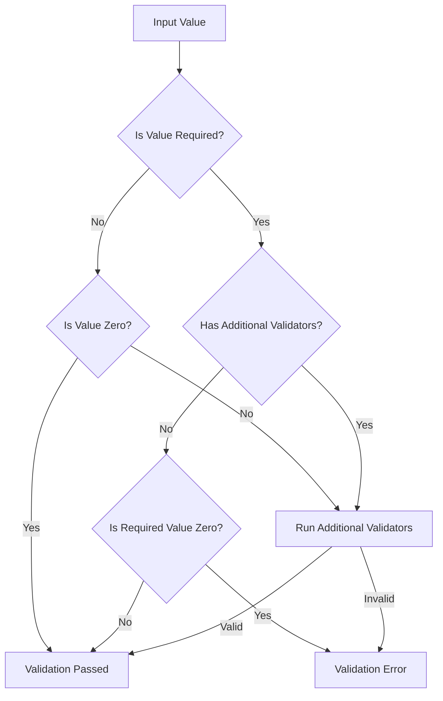
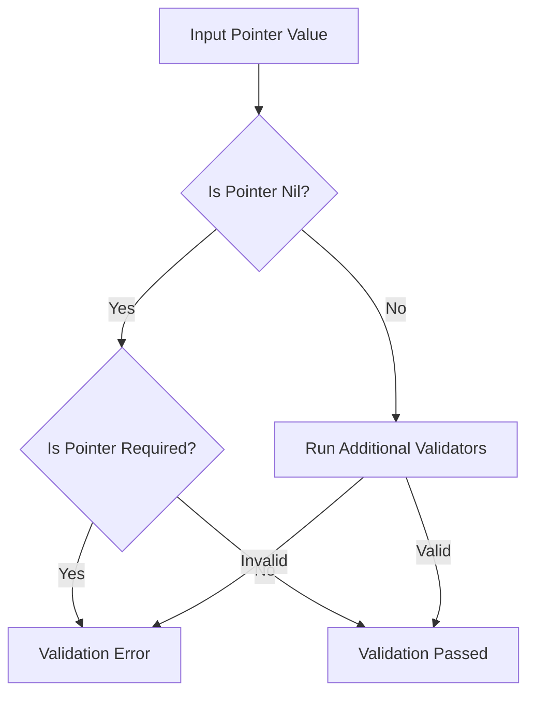

## 校驗流程





## 功能特點

1. 支持結構體標籤驗證
2. 支持自定義驗證器
3. 支持嵌套結構體驗證
4. 支持 Map 和 Slice 驗證
5. 支持多種數據類型驗證（int、float、decimal、time 等）
6. 支持正則表達式驗證
7. 支持枚舉值驗證

## Tags
參考`go-playground/validator`的tag定義

### Main Tag: `validate`

### Supported Sub Tags
| Tag       | Description                                                     |
|-----------|-----------------------------------------------------------------|
| required  | 是否必填,如未指定則根據labelTag是否有,omitempty賦值，如不存在labelTag則默認為true |
| label     | 錯誤提示的欄位名稱                                                       |
| dive      | 開始數組或map子集的規則                                                   |
| keys      | 開始定義map key                                                     |
| endkeys   | 結束定義map value,若未定義則keys後的所有內容都作為keys的定義                         |
| min       | 數字類型校驗最小值 其餘校驗長度                                                |
| max       | 數字類型校驗最大值 其餘校驗長度                                                |
| pattern   | 正則校驗                                                            |

以上tags其行為與`go-playground/validator`完全一致

新增tags:

| Tag      | Description      |
|----------|------------------|
| ignore,- | 忽略欄位             |


當`validate`標籤未指定`required`時，會使用這些標籤的`omitempty`值取反

## 驗證選項

### AlwaysValidate

- 不管`validate`和labelTag定義的tag是否存在，都參與校驗
- 默認行為是有`validate`或者有定義labelTag且labelTag在field存在才參與校驗

```go
ValidateStructWithCache(value, AlwaysValidate())
```

### WithLabelTag
```go
// 使用 json 標籤作為錯誤提示的欄位名稱
ValidateStructWithCache(value, WithLabelTag("json"))
```
- 指定用於錯誤提示的欄位名稱標籤
- 當 `validate` 標籤未指定 `label` 時，會使用此標籤的值
- 支持 json、yaml、form、query、path、header 等標籤
- 如都未指定，則使用屬性名

## 使用示例

### 基本使用

```go
type User struct {
    Name     string    `validate:"required,min=2,max=50" json:"name"`
    Age      int       `validate:"required,min=0,max=150" json:"age"`
    Email    string    `validate:"required,pattern=^[a-zA-Z0-9._%+-]+@[a-zA-Z0-9.-]+\\.[a-zA-Z]{2,}$" json:"email"`
    Birthday time.Time `validate:"required" json:"birthday"`
}

user := User{
    Name: "张三",
    Age: 25,
    Email: "zhangsan@example.com",
    Birthday: time.Now(),
}

// 使用泛型方法进行验证
if err := ValidateStructWithCache(user, WithLabelTag("json")); err != nil {
    // 处理验证错误
    return
}
```

### 嵌套結構體驗證

```go
type Address struct {
    Street string `validate:"required" json:"street"`
    City   string `validate:"required" json:"city"`
}

type User struct {
    Name    string  `validate:"required" json:"name"`
    Address Address `validate:"dive" json:"address"`
}

user := User{
    Name: "张三",
    Address: Address{
        Street: "人民路",
        City:   "北京",
    },
}

if err := ValidateStructWithCache(user, WithLabelTag("json")); err != nil {
    // 处理验证错误
    return
}
```

### Map 驗證

```go
type Config struct {
    Settings map[string]string `validate:"dive,keys,required,endkeys,required" json:"settings"`
}

config := Config{
    Settings: map[string]string{
        "key1": "value1",
        "key2": "value2",
    },
}

if err := ValidateStructWithCache(config, WithLabelTag("json")); err != nil {
    // 处理验证错误
    return
}
```

### 自定義驗證器

```go
// 1. 定义自定义类型
type CustomString string

// 2. 定义自定义验证器构建器
func customStringValidatorBuilder(typ reflect.Type, rule *Rule) (Validator, bool) {
    // 只处理 CustomString 类型
    if typ != reflect.TypeOf(CustomString("")) {
        return nil, false
    }

    // 返回验证器函数
    return func(value reflect.Value) errx.Error {
        str := value.String()
        if str == "" {
            return errx.Validation.WithMsg("value cannot be empty").Err()
        }
        if len(str) < 2 {
            return errx.Validation.WithMsg("value length must be greater than 2").Err()
        }
        return nil
    }, true
}

// 3. 注册自定义验证器
func init() {
    RegisterValidatorBuilder(customStringValidatorBuilder)
}

// 4. 使用自定义验证器
type Request struct {
    Name CustomString `validate:"required" json:"name"`
}

request := Request{
    Name: CustomString("张三"),
}

if err := ValidateStructWithCache(request, WithLabelTag("json")); err != nil {
    // 处理验证错误
    return
}
```

### 實現 Validatable 接口

```go
// 1. 定义自定义类型
type ValidatableString string

// 2. 实现 Validatable 接口
func (v ValidatableString) Validate() errx.Error {
    str := string(v)
    if str == "" {
        return errx.Validation.WithMsg("value cannot be empty").Err()
    }
    if len(str) < 2 {
        return errx.Validation.WithMsg("value length must be greater than 2").Err()
    }
    return nil
}

// 3. 使用自定义类型
type Request struct {
    Name ValidatableString `validate:"required" json:"name"`
}

request := Request{
    Name: ValidatableString("张三"),
}

if err := ValidateStructWithCache(request, WithLabelTag("json")); err != nil {
    // 处理验证错误
    return
}
```
